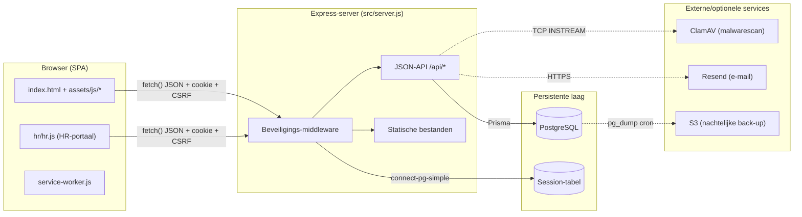
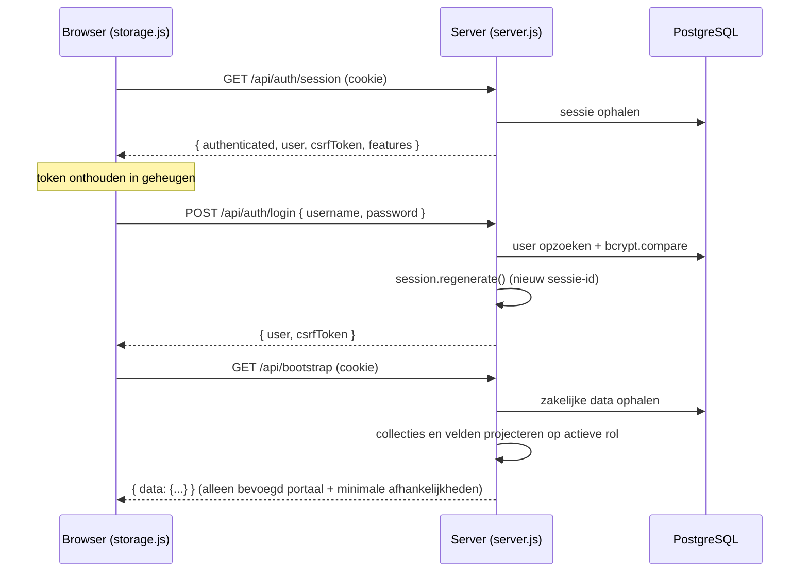
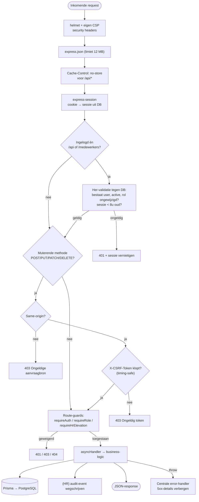
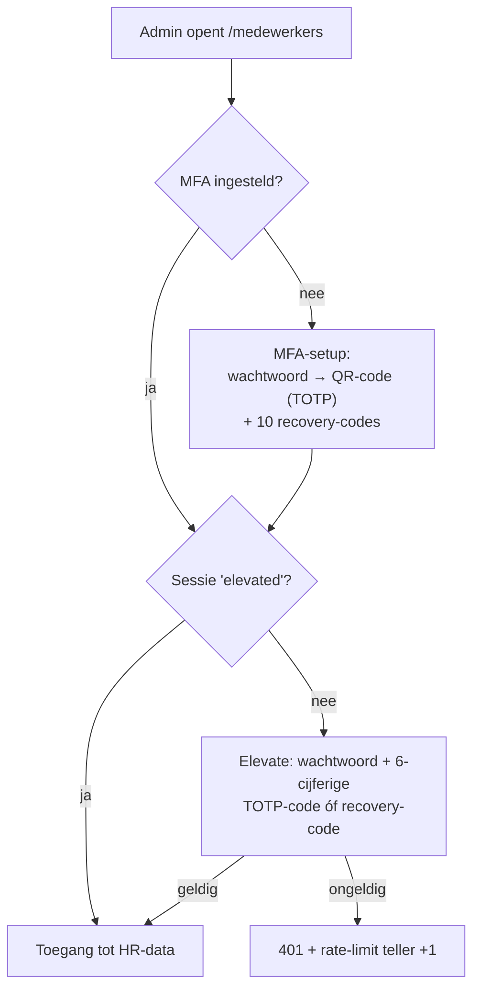
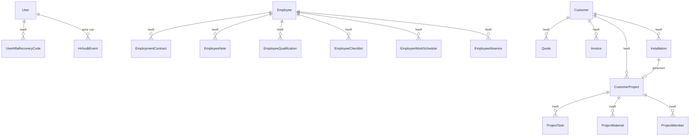
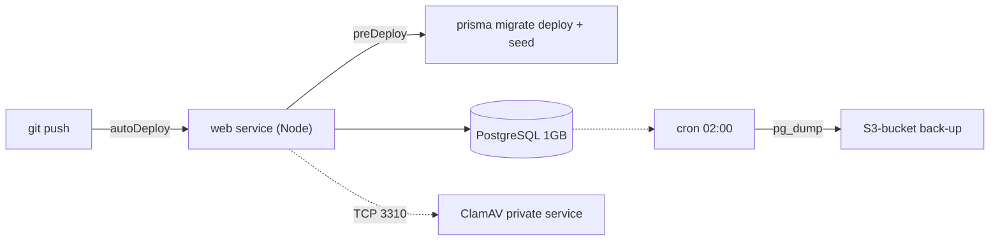

# Software­architectuur — Climature Bedrijfsportaal

> Technisch architectuurdocument. Beschrijft hoe de applicatie is opgebouwd, hoe de
> frontend met de API praat, en hoe elke request door de beveiligingslagen gaat.
> Aanvullend op `TECHNISCHE_HANDLEIDING.md` (functionele/operationele handleiding).
>
> Versie: 2.1.0 · Laatst bijgewerkt: 2026-07-16

---

## 1. Overzicht in één oogopslag

Climature Bedrijfsportaal is een **monolithische Node.js-webapplicatie** die zowel de
statische frontend (een vanilla-JS Single Page App) als een JSON-API serveert vanaf
dezelfde origin. Er is één Express-server, één PostgreSQL-database (via Prisma), en drie
optionele randservices (ClamAV, e-mail via Resend, nachtelijke back-up naar S3).

De applicatie bestaat uit vijf functionele werkportalen in één zakelijke SPA plus een afzonderlijk, extra beveiligd HR-portaal op dezelfde server:

| Portaal | URL | Doelgroep | Extra beveiliging |
|---|---|---|---|
| **CRM** | `/#crm-portal` | admin of CRM; beperkte klantcontext voor installateur | Sessie-login + serverrol |
| **Sales** | `/#sales-portal` | admin of Sales | Sessie-login + serverrol |
| **Uitvoering** | `/#execution-portal` | admin, Uitvoering of beperkte installateur | Sessie-login + serverrol/projectlidmaatschap |
| **Service** | `/#service` | admin, Uitvoering of beperkte installateur; leesprojecties voor CRM/Financiën | Sessie-login + serverrol/toewijzing |
| **Financiën** | `/#finance-portal` | admin of Financiën | Sessie-login + serverrol |
| **Beheer** | `/#management-portal` | alleen admin | Sessie-login + serverrol |
| **Werknemersportaal (HR)** | `/medewerkers` | alleen admin | Sessie-login **+** verplichte MFA-elevatie |



---

## 2. Technologiekeuzes

| Laag | Technologie | Waarom |
|---|---|---|
| Runtime | **Node.js ≥ 24 LTS** | Wordt hard afgedwongen bij opstart (`main()`) |
| Webframework | **Express 5** | Routing + middleware |
| Database | **PostgreSQL** | Relationele data, transacties |
| ORM | **Prisma 6** | Type-safe queries, migraties, seed |
| Sessies | **express-session + connect-pg-simple** | Server-side sessies in de DB |
| Wachtwoorden | **bcrypt** (cost 12) | Hashing |
| MFA | **otplib** (TOTP) + QR via `qrcode` | HR two-factor |
| HTTP-hardening | **helmet** + eigen CSP | Security headers |
| Uploads | **multer** (memory storage) | PDF-upload in geheugen, max 8 MB |
| Malwarescan | **ClamAV** (raw TCP `zINSTREAM`) | Uploads scannen |
| Frontend | **Vanilla JS** (geen build-stap) | Statische `assets/js/*.js` |

De frontend heeft **geen bundler/transpiler**: de browser laadt de losse `.js`-bestanden
rechtstreeks. Dit houdt de deploy simpel (geen buildpipeline voor de client).

---

## 3. Mappenstructuur

```
Climature Bedrijfsportaal/
├── src/                      # Backend (Node.js)
│   ├── server.js             # Express-app, alle routes + middleware  ← kern
│   ├── config.js             # Env-variabelen inladen & valideren
│   ├── prisma.js             # Prisma-client (singleton)
│   ├── users.js              # Auth, gebruikersbeheer, bootstrap-admin
│   ├── hr-security.js        # Encryptie, MFA, ClamAV-scan, audit-log
│   ├── hr-data.js            # HR: werknemers, contracten, notities
│   ├── hr-workforce.js       # HR: kwalificaties, checklists, skills-matrix
│   ├── project-data.js       # Projecten, taken, materiaal, planning
│   ├── data.js               # CRM-collecties (klanten, offertes, facturen…)
│   ├── defaults.js           # Standaard producten & instellingen
│   ├── advice-assumptions.js # Aannames voor de adviestool
│   └── project-digest.js     # Nachtelijke projectsamenvatting per e-mail
├── prisma/
│   ├── schema.prisma         # Datamodel (39 modellen)
│   └── seed.js               # Basisdata bij eerste start
├── assets/                   # CRM-frontend (statisch)
│   ├── js/storage.js         # ← API-client van de CRM (fetch-wrapper)
│   ├── js/app.js             # UI-orkestratie
│   └── js/{customers,quotes,invoices,installations,projects,...}.js
├── hr/                       # HR-frontend (statisch, aparte SPA)
│   ├── hr.js                 # ← API-client + UI van het HR-portaal
│   └── index.html
├── index.html                # CRM-shell (SPA-entrypoint)
├── service-worker.js         # PWA/offline caching
├── render.yaml               # Infrastructuur-as-code (Render.com)
└── scripts/                  # hash-password, back-up, project-digest
```

---

## 4. Hoe een API-call verloopt (frontend → backend)

### 4.1 De API-client in de frontend

Alle CRM-calls lopen via één centrale wrapper `api()` in
[`assets/js/storage.js`](assets/js/storage.js#L74). Het HR-portaal heeft een eigen,
identiek werkende wrapper in [`hr/hr.js`](hr/hr.js#L19).

```js
// assets/js/storage.js — vereenvoudigd
function api(path, options) {
  options = options || {};
  var headers = Object.assign({ "Content-Type": "application/json" }, options.headers);

  // Bij muterende requests: het CSRF-token meesturen
  if (["POST","PUT","PATCH","DELETE"].indexOf(method) >= 0 && currentCsrfToken) {
    headers["X-CSRF-Token"] = currentCsrfToken;
  }

  return fetch(path, {
    credentials: "same-origin",   // stuurt de sessie-cookie mee
    headers: headers,
    ...options
  }).then(function (response) {
    return response.text().then(function (text) {
      var payload = text ? JSON.parse(text) : {};
      if (!response.ok) throw new Error(payload.error || "Serververzoek mislukt.");
      return payload;
    });
  });
}
```

Belangrijke eigenschappen:

- **`credentials: "same-origin"`** — de HttpOnly sessie-cookie gaat automatisch mee; er
  worden geen tokens in JavaScript opgeslagen (bescherming tegen XSS-tokendiefstal).
- **`X-CSRF-Token`** — alleen bij muterende methodes. Het token komt uit de
  sessie-response (zie 4.2) en wordt door de server op de sessie gevalideerd.
- **Foutafhandeling** — een niet-`2xx`-response wordt omgezet in een `Error` met het
  server-`error`-veld, zodat de UI een nette melding kan tonen.

### 4.2 De opstart-handshake (sessie + CSRF ophalen)

Bij het laden roept de frontend eerst `GET /api/auth/session` aan. Die geeft terug of je
bent ingelogd, wie je bent, én het **CSRF-token** dat je vanaf dat moment meestuurt.



`POST /api/auth/login` doet bewust **`session.regenerate()`** na succesvolle login: het
sessie-ID wordt vervangen om *session fixation* te voorkomen.

### 4.3 De volledige request-lifecycle door de middleware

Elke request passeert onderstaande lagen in volgorde. Dit is de kern van de beveiliging.



Referenties in de code:
- Security headers/CSP: [`src/server.js:148`](src/server.js#L148)
- Sessie-her-validatie tegen DB: [`src/server.js:193`](src/server.js#L193)
- CSRF + same-origin-check: [`src/server.js:215`](src/server.js#L215)
- Centrale error-handler: [`src/server.js:780`](src/server.js#L780)

---

## 5. Beveiligingsarchitectuur

De beveiliging is opgebouwd uit **gelaagde controles** (defense-in-depth). Geen enkele
laag staat alleen.

### 5.1 Transport & headers

- **HSTS** aan in productie (helmet), `x-powered-by` uitgeschakeld.
- **Strikte Content-Security-Policy** (handmatig gezet, niet die van helmet):
  `default-src 'self'`, `object-src 'none'`, `frame-ancestors 'none'`,
  `base-uri 'self'`, `form-action 'self'`. De adviestool-pagina krijgt gecontroleerd
  iets ruimere regels (`'unsafe-inline'` script + `frame-ancestors 'self'`).
- **`Referrer-Policy: no-referrer`** en **`Cache-Control: no-store`** op alle `/api/*`.

### 5.2 Authenticatie (wie ben je?)

- Wachtwoorden gehasht met **bcrypt cost 12**; login-vergelijking altijd via
  `bcrypt.compare` (geen timing-lek op "gebruiker bestaat niet").
- **Bootstrap-admin**: bij een lege database wordt exact één admin aangemaakt uit
  `ADMIN_USERNAME` + `ADMIN_PASSWORD_HASH` (env). Zie [`src/users.js:70`](src/users.js#L70).
- **Sessies** zijn server-side in PostgreSQL (`connect-pg-simple`), niet in de cookie.
  De cookie is:
  - `httpOnly` (niet leesbaar voor JS),
  - `sameSite: "strict"`,
  - `secure` in productie,
  - `__Host-`-prefix in productie (bindt de cookie aan host + `path=/` + `secure`),
  - `rolling` met `maxAge` 30 min (schuift mee bij activiteit).
- **Absolute sessieduur**: los van de rolling-cookie wordt een sessie na **8 uur**
  hard beëindigd ([`src/server.js:199`](src/server.js#L199)).
- **Live her-validatie**: bij elke API-call wordt de gebruiker opnieuw uit de DB
  gelezen. Is het account gedeactiveerd of de rol gewijzigd, dan wordt de sessie direct
  ongeldig ([`src/server.js:204`](src/server.js#L204)).

### 5.3 Autorisatie (wat mag je?)

Route-guards en centrale collectiematrices bepalen toegang:

| Guard | Betekenis |
|---|---|
| `requireAuth` | Geldig ingelogd account |
| `requireRole("admin")` | Alleen admin |
| `requireRole("admin","execution")` | Beheerder of uitvoeringsmanager |
| `ROLE_COLLECTIONS` | Leescollecties per CRM-, Sales-, Uitvoering-, Financiën- of installateursrol |
| `ROLE_WRITE_COLLECTIONS` | Schrijfcollecties per portaalrol |
| `requireHrElevation` | Admin **met** geldige MFA-elevatie |

`roleBootstrap()` bouwt per sessierol een afzonderlijke payload. CRM krijgt alleen klantcollecties; Sales krijgt commerciële collecties; Uitvoering planning en projecten; Financiën facturatie; Beheer alles. Noodzakelijke domeinafhankelijkheden worden op veldniveau beperkt: kanaalrollen krijgen bijvoorbeeld klantcontactvelden zonder CRM-notities en Uitvoering krijgt alleen basismetadata van offertes. Bij installateurs worden `employeeId` en `qualificationCheck` verwijderd. Dezelfde projectie wordt ook toegepast op losse collectie-GET’s, zodat `/api/bootstrap` niet de enige beveiligingsgrens is.

### 5.4 CSRF-bescherming

Twee onafhankelijke controles op elke muterende request:

1. **Same-origin-check** — de `Origin`-header moet ontbreken of gelijk zijn aan de
   eigen origin.
2. **CSRF-token** — een per-sessie random token (`crypto.randomBytes(32)`), vergeleken
   met **`crypto.timingSafeEqual`**. De login-route is uitgezonderd (je hebt dan nog
   geen token); voor de testomgeving bestaat een gecontroleerde bypass.

### 5.5 Rate limiting

In-memory *failure limiters* (per IP + gebruiker):

- **Login**: 5 pogingen / 15 min.
- **MFA-elevatie**: 5 pogingen / 10 min.

Bij succes wordt de teller gereset ([`src/server.js:47`](src/server.js#L47)).

### 5.6 HR-portaal: extra beveiligingslaag

Het werknemersportaal bevat de meest gevoelige data en heeft daarom een **step-up
authenticatie** bovenop de gewone login:



Kenmerken van de HR-laag ([`src/hr-security.js`](src/hr-security.js), guards in
[`src/server.js:264`](src/server.js#L264)):

- **Elevatie-venster**: geldig max **60 min** en verloopt na **15 min** inactiviteit
  (`isHrElevated`). Elke HR-call ververst de activiteitstimer.
- **TOTP anti-replay**: `mfaLastUsedStep` wordt bijgehouden; een reeds gebruikte code
  wordt afgewezen ("Deze authenticatorcode is al gebruikt").
- **Encryptie in rust (AES-256-GCM)**: MFA-secrets, contract-PDF's, notitie-inhoud en
  kwalificatiebewijzen worden versleuteld opgeslagen (`cipher`/`iv`/`tag` in aparte
  kolommen). De sleutel komt uit `HR_ENCRYPTION_KEY` (32 bytes). Recovery-codes worden
  als **HMAC-SHA256** opgeslagen, niet plain.
- **Malwarescan**: elke geüploade PDF gaat via raw TCP `zINSTREAM` naar **ClamAV**.
  Bij een niet-schone of onbereikbare scanner krijgt het bestand status `quarantine` en
  is downloaden geblokkeerd (HTTP 423) tot een geslaagde her-scan. In productie is een
  bereikbare scanner **verplicht** (`config.js` faalt bij ontbrekende `CLAMAV_HOST`).
- **Audit-log**: vrijwel elke HR-actie schrijft een `HrAuditEvent` weg met actor, actie,
  entiteit, metadata en een **gehashte IP** (HMAC, niet het rauwe IP).
- **Gevaarlijke acties dubbel bevestigd**: definitief verwijderen van een werknemer
  (`purge`) vereist archivering vooraf, het juiste personeelsnummer ter bevestiging,
  én opnieuw wachtwoord + tweede factor.

### 5.7 Uploads

`multer` met memory-storage, hard begrensd op **8 MB**, **1 bestand**, **12 velden**.
Bij overschrijding volgt HTTP 413. Bestanden worden nooit rauw op schijf gezet — ze
worden gescand en daarna versleuteld in de database opgeslagen.

---

## 6. Datamodel (hoofdlijnen)

Prisma-schema met 47 modellen ([`prisma/schema.prisma`](prisma/schema.prisma)), grofweg
in vijf domeinen:



- **Auth & HR-security**: `User`, `UserMfaRecoveryCode`, `HrAuditEvent`.
- **HR-workforce**: `Employee`, `EmploymentContract`, `EmployeeNote`,
  `QualificationDefinition`, `EmployeeQualification`, `QualificationRequirement`,
  `ChecklistTemplate(+Item)`, `EmployeeChecklist(+Item)`, werkrooster & afwezigheid.
- **CRM/sales**: `Customer`, `CustomerNote`, `CustomerDocument`, `Product`, `Quote(+Line)`,
  `Invoice(+Line)`, `Advice`, `SalesOpportunity`, `SalesAppointment`.
- **Projecten**: `Installation`, `CustomerProject`, `ProjectTask`, `ProjectMaterial`,
  `ProjectMember`, `ProjectEquipment`, `ProjectTemplate(+Task/Material)`,
  `ProjectAuditEvent`, `ProjectDigestRun`.
- **Service**: `ServiceContract`, `CustomerEquipment`, `ServiceRequest`,
  `MaintenanceVisit`, `MaintenanceMeasurement`, `ServiceDocument`,
  `ServiceAuditEvent`, `ServiceReminderRun`.
- **Infrastructuur**: `Setting`, `Counter`, `Session`.

Encryptie zit op kolomniveau: waar velden gevoelig zijn, staat naast het veld een
`...Cipher` / `...Iv` / `...Tag` + `keyVersion`-kolom (zie 5.6).

---

## 7. API-oppervlak (samengevat)

Alle endpoints staan onder `/api/*` en geven/verwachten JSON. Onderstaande tabel toont
het patroon en de vereiste rol.

| Groep | Voorbeeldroutes | Vereiste toegang |
|---|---|---|
| **Auth** | `GET /api/auth/session`, `POST /api/auth/login`, `POST /api/auth/logout`, `PUT /api/auth/me` | Publiek → sessie |
| **Bootstrap** | `GET /api/bootstrap` | Ingelogd; collectie- en veldprojectie per rol |
| **Zakelijke collecties** | `GET/POST/PUT /api/collections/:collection`, `DELETE /api/collections/:collection/:id` | Lezen/schrijven volgens portaalmatrix; bulk-`PUT` alleen admin |
| **Nummering** | `POST /api/counters/:type/next`, `GET /api/counters/:type/peek` | Admin; Sales voor offertes; Financiën voor facturen |
| **Projecten** | `GET/POST/PUT /api/projects…`, taken/materiaal/team/equipment | Beheer: admin/Uitvoering; installateur alleen toegewezen operationele data |
| **Service** | `/api/service/equipment`, `contracts`, `requests`, `visits`, documenten, factuur en e-mailacties | Admin/Uitvoering beheren; installateur alleen toegewezen bezoeken; CRM/Financiën minimale leesprojectie |
| **Gebruikers** | `GET/POST/PUT /api/users` | Admin |
| **Instellingen** | `GET/PUT /api/settings` | Admin |
| **HR-sessie/MFA** | `GET /api/hr/session`, `POST /api/hr/mfa/setup/*`, `POST /api/hr/elevate`, `POST /api/hr/lock` | Admin |
| **HR-data** | `/api/hr/employees…`, contracten, notities, kwalificaties, checklists, rooster | Admin **+ elevatie** |
| **Back-up** | `GET /api/backup/export`, `POST /api/backup/import`, `POST /api/admin/reset` | Admin |
| **Health** | `GET /api/health` | Publiek (voor Render health-check) |

Onbekende `/api/*`-routes geven een nette `404 { error }`; alle andere paden vallen terug
op de SPA (`index.html`).

---

## 8. Serverstart & levenscyclus

`main()` in [`src/server.js:772`](src/server.js#L772) voert bij opstart uit:

1. **Node-versiecheck** (< 24 → fout).
2. `loadConfig()` — env inladen en valideren (o.a. verplichte `HR_ENCRYPTION_KEY` als HR
   aanstaat; `ALLOW_UNSCANNED_HR_FILES` is in productie verboden).
3. `ensureBootstrapAdmin()` — eerste admin aanmaken indien nodig.
4. `data.bootstrap()` — standaard producten/instellingen zaaien.
5. `workforce.ensureDefaults()` — standaard kwalificaties/checklists.
6. `projects.ensureProjectsForExistingInstallations()` — data-migratie/consistentie.
7. `app.listen(config.port)`.

---

## 9. Deployment (Render.com)

Infrastructuur staat als code in [`render.yaml`](render.yaml). Regio **Frankfurt** (EU,
i.v.m. AVG). Vier onderdelen:



- **web service** — de Express-app. `SESSION_SECRET` en `HR_ENCRYPTION_KEY` worden door
  Render gegenereerd; `ADMIN_PASSWORD_HASH` wordt handmatig gezet (`sync: false`).
- **PostgreSQL** — `ipAllowList: []` (geen publiek IP, alleen intern bereikbaar).
- **ClamAV** — private service, alleen intern.
- **cron 02:00** — nachtelijke `pg_dump` naar een versleutelde S3-bucket.

Health-check draait op `GET /api/health` (voert een `SELECT 1` op de DB uit).

---

## 10. Belangrijkste beveiligingsuitgangspunten (samenvatting)

1. **Zelfde origin voor alles** — frontend en API delen de origin; geen CORS-versoepeling
   nodig, cookies blijven `SameSite=strict`.
2. **Server-side sessies** — geen gevoelige data of tokens in de browser-opslag.
3. **Dubbele CSRF-verdediging** — origin-check én timing-safe token.
4. **Least privilege** — installateur ziet en muteert bewust minder; data wordt server-
   side gefilterd, niet alleen in de UI.
5. **Step-up voor HR** — MFA-elevatie met korte tijdvensters voor de gevoeligste data.
6. **Encryptie in rust** — HR-documenten en secrets AES-256-GCM, recovery-codes gehasht.
7. **Elke upload gescand** — ClamAV verplicht in productie, quarantaine bij twijfel.
8. **Volledig audit-spoor** — HR-acties gelogd met gehasht IP.
9. **Foutdetails afgeschermd** — 5xx-fouten tonen nooit interne details aan de client.

---

*Vragen of aanpassingen aan dit document? De bronbestanden hierboven zijn met
regelnummers gelinkt zodat je direct naar de betreffende code kunt springen.*
