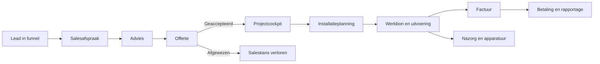
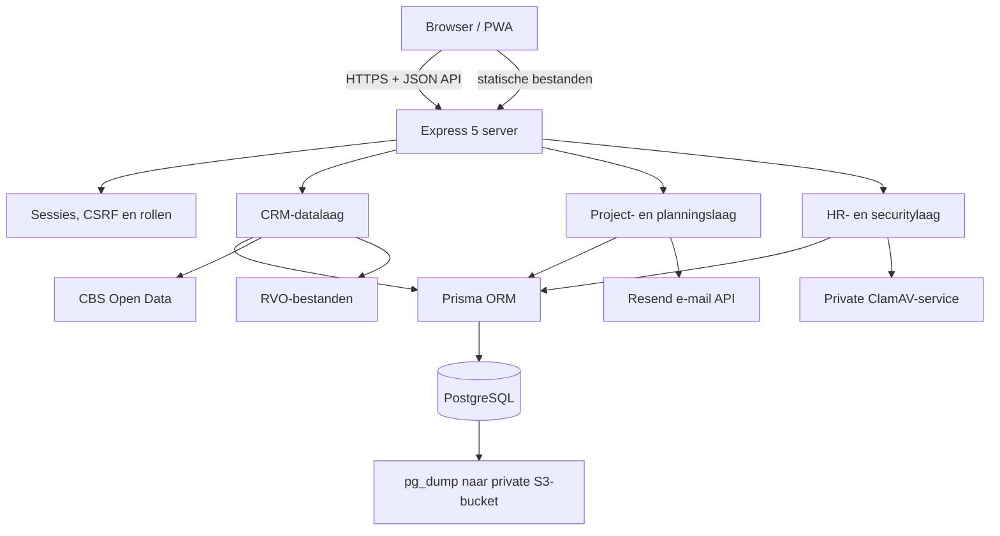
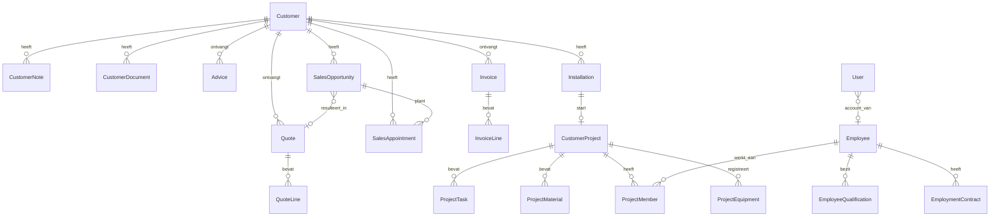

# Climature Bedrijfsportaal — handleiding en technisch ontwerp

Documentstatus: 15 juli 2026  
Applicatieversie: 2.0.0  
Doelgroep: beheerders, ontwikkelaars, functioneel beheerders en technisch auditors

> Dit document bevat bewust geen wachtwoorden, tokens of encryptiesleutels. Bewaar die uitsluitend in een wachtwoordmanager of secret store.

## Inhoud

1. [Doel en functionele indeling](#1-doel-en-functionele-indeling)
2. [Dagelijks gebruik](#2-dagelijks-gebruik)
3. [Proces van lead tot nazorg](#3-proces-van-lead-tot-nazorg)
4. [Technische architectuur](#4-technische-architectuur)
5. [Frontend](#5-frontend)
6. [Backend](#6-backend)
7. [API-ontwerp](#7-api-ontwerp)
8. [Databaseontwerp](#8-databaseontwerp)
9. [Beveiligingsontwerp](#9-beveiligingsontwerp)
10. [Configuratie en secrets](#10-configuratie-en-secrets)
11. [Lokaal ontwikkelen](#11-lokaal-ontwikkelen)
12. [Testen](#12-testen)
13. [Deployment op Render](#13-deployment-op-render)
14. [Back-up en herstel](#14-back-up-en-herstel)
15. [Monitoring en beheer](#15-monitoring-en-beheer)
16. [Uitbreiden van de applicatie](#16-uitbreiden-van-de-applicatie)
17. [Bekende aandachtspunten](#17-bekende-aandachtspunten)

## 1. Doel en functionele indeling

Het Climature Bedrijfsportaal ondersteunt de volledige commerciële en operationele keten van een installatiebedrijf. Technisch is het één webapplicatie met één login, API en database. Functioneel bestaat het uit vijf afzonderlijke portalen en een gedeelde servicewerkruimte. Zo blijven gekoppelde gegevens centraal zonder dat afdelingen door elkaars menu’s hoeven te werken.

| Werkgebied | Onderdelen | Hoofddoel |
|---|---|---|
| Start | Portaalkeuze | Alleen portalen tonen waarvoor de gebruiker rechten heeft |
| CRM | Klantenbestand | Relaties, contactgegevens, documenten en historie |
| Sales | Sales funnel, sales agenda, advies en offertes | Van lead naar geaccepteerde opdracht |
| Uitvoering | Projecten en installaties | Werkvoorbereiding, planning en uitvoering |
| Service | Contracten, apparaten, meldingen en onderhoudsbezoeken | Nazorg, storingen en terugkerend onderhoud |
| Financiën | Facturen en rapportage | Facturatie, opvolging en omzetinzicht |
| Beheer & tools | Producten, tekstgenerator, instellingen en werknemersportaal | Stamdata, communicatie, accounts en HR |

De gekozen scheiding voorkomt dat sales, uitvoering en administratie door elkaar lopen, terwijl alle onderdelen dezelfde klant-, offerte- en projectgegevens gebruiken.

## 2. Dagelijks gebruik

### 2.1 Inloggen

1. Open de applicatie in de browser.
2. Vul de persoonlijke gebruikersnaam en het wachtwoord in.
3. De server maakt na succesvolle controle een beveiligde sessiecookie aan.
4. Voor het werknemersportaal is aanvullend een authenticator- of herstelcode nodig.

Gebruik geen gedeelde beheerdersaccounts in productie. Maak per medewerker een eigen account en deactiveer het account bij uitdiensttreding.

### 2.2 Portaalkeuze en portaaloverzichten

Na login opent **Alle portalen**. De portaalkeuze toont uitsluitend de werkruimte waarvoor het account bevoegd is. Een beheerder ziet CRM, Sales, Uitvoering, Financiën en Beheer; een CRM-, Sales-, Uitvoering- of Financiën-account ziet alleen het gelijknamige portaal. De installateur heeft een beperkte werkroute via Uitvoering en het noodzakelijke klantdossier. Na het openen van een portaal toont de zijbalk uitsluitend de functies van dat portaal plus de vaste knop om terug te keren naar de portaalkeuze.

| Accountrol | Zichtbare werkruimte | Hoofdrechten |
|---|---|---|
| Beheerder (`admin`) | Alle portalen | Volledig beheer en accountbeheer; HR na extra MFA-controle |
| CRM (`crm`) | CRM | Klanten, contactnotities en klantdocumenten beheren |
| Sales (`sales`) | Sales | Funnel, agenda, advies en offertes beheren |
| Uitvoering (`execution`) | Uitvoering | Installaties, projectplanning, materiaal, taken en bezetting beheren |
| Financiën (`finance`) | Financiën | Facturen, betalingen en rapportage beheren |
| Installateur (`installer`) | Beperkte Uitvoering/klantcontext | Werkbonnen en toegewezen operationele projecttaken bijwerken |

Een portaalrol krijgt voor keuzelijsten alleen de minimaal noodzakelijke projectie uit een ander domein. Sales ontvangt bijvoorbeeld klantcontactvelden om een offerte te maken, maar geen CRM-notities en geen toegang tot het CRM-portaal. Uitvoering ontvangt alleen basisoffertegegevens voor de overdracht naar planning. Zulke leesafhankelijkheden geven nooit schrijf- of navigatierechten op het andere portaal.

Ieder portaal heeft een eigen overzicht:

- CRM: aantallen klanten, ontbrekende contactgegevens en recente relaties;
- Sales: open kansen, opvolging, afspraken en actieve offertes;
- Uitvoering: installaties van vandaag, ingepland werk, projectwaarschuwingen en eerstvolgende opdrachten;
- Financiën: openstaande, verlopen en betaalde bedragen plus omzetweergave;
- Beheer: producten, betaaltermijn, HR-status en links naar configuratie en hulpmiddelen.

De knop **Portalen** in de bovenbalk en **Alle portalen** in de zijbalk brengen de gebruiker altijd terug naar de portaalkeuze.

### 2.3 CRM

Gebruik **Klantenbestand** voor:

- persoonsgegevens en bedrijfsgegevens;
- adressen en contactgegevens;
- klantnotities;
- klantdocumenten;
- gekoppelde adviezen, offertes, facturen en installaties;
- toegang tot de projecthistorie van de klant.

Een klant kan worden verwijderd zolang databaserelaties met een restrictie dit toelaten. Bij operationele historie verdient archiveren of behouden de voorkeur boven verwijderen.

### 2.4 Sales funnel

De funnel bevat deze fasen:

1. Lead — 10% standaardkans;
2. Contact — 25%;
3. Advies — 40%;
4. Offerte maken — 55%;
5. Offerte verstuurd — 70%;
6. Gewonnen — 100%;
7. Verloren — 0%.

Per kans worden contact, klant, bron, waarde, kanspercentage, sluitdatum, opvolgdatum, notities en eventueel een offerte vastgelegd. Een offertestatus synchroniseert de gekoppelde saleskans automatisch:

- `concept` → offerte maken;
- `verstuurd` → offerte verstuurd;
- `geaccepteerd` of `geaccepteerd/aanbetaling` → gewonnen;
- `afgewezen` → verloren.

### 2.5 Sales agenda

De salesagenda biedt maand- en weekweergave. Een afspraak bevat:

- titel en type;
- datum, starttijd en eindtijd;
- status: gepland, afgerond of geannuleerd;
- optionele klant- en saleskoppeling;
- contactpersoon, locatie of vergaderlink en notities.

Een afspraak kan direct vanuit een saleskans worden gepland. De klant en saleskans worden dan vooraf ingevuld.

### 2.6 Advies

De adviestool ondersteunt warmtepomp- en thuisbatterijberekeningen. Aannames staan in de centrale instellingen. Een beheerder kan energietarieven en subsidiegegevens actualiseren vanuit CBS en RVO. Als een externe bron faalt, blijven de laatst bekende of handmatige waarden beschikbaar en wordt de fout in de bronstatus vastgelegd.

Een opgeslagen advies kan als basis voor een offerte worden gebruikt.

### 2.7 Offertes

Een offerte bevat klant, datum, geldigheid, status, voorwaarden en regels met aantallen, prijzen en btw. De browser berekent subtotalen, btw en totaal; de server berekent deze waarden opnieuw en is daarmee leidend.

Offertestatussen zijn:

- concept;
- verstuurd;
- geaccepteerd;
- geaccepteerd/aanbetaling;
- afgewezen.

Vanuit een offerte kan een factuur of installatie worden gestart. PDF-generatie en afdrukken gebeuren in de browser via jsPDF.

### 2.8 Projecten en installaties

Een installatie bevat klant, datum, starttijd, duur, werksoort, monteur, status en werkbon. Werksoorten zijn airconditioning, warmtepomp, cv-ketel, thuisbatterij en overig.

Bij het opslaan van een installatie wordt automatisch een projectcockpit aangemaakt of bijgewerkt. Het project bevat:

- projectnummer en planning;
- eigenaar en projectteam;
- taken uit een werksoorttemplate;
- materialen met bestel- en leverdata;
- apparatuur en optionele externe apparaat-ID;
- inzetbaarheid en kwalificatiecontrole;
- readinessstatus groen, oranje of rood;
- auditlog van projectwijzigingen.

Datums voor automatische taken en materialen worden opnieuw berekend wanneer de installatiedatum wijzigt. Monteurs zien alleen projecten waaraan hun gekoppelde werknemerrecord als projectlid is toegevoegd.

Installatiestatussen zijn `ingepland`, `uitgevoerd` en `geannuleerd`.

### 2.9 Facturen en rapportage

Facturen kunnen handmatig of vanuit een offerte worden gemaakt. Statussen zijn `concept`, `verzonden`, `betaald` en `verlopen`. De server markeert verzonden facturen na de vervaldatum automatisch als verlopen wanneer de bootstrapdata wordt geladen.

De rapportage biedt periodefilters, totalen en CSV-export. Financiële bedragen worden opnieuw op de server berekend om manipulatie van browserwaarden te voorkomen.

### 2.10 Werknemersportaal

Het werknemersportaal is alleen beschikbaar als `HR_PORTAL_ENABLED=true`. Alleen beheerders met een recent verhoogde HR-sessie hebben toegang. Het portaal beheert:

- werknemers en versleutelde privégegevens;
- arbeidsovereenkomsten en versleutelde PDF-bestanden;
- versleutelde HR-notities;
- kwalificaties, bewijsstukken en een skillsmatrix;
- eisen per werksoort;
- onboarding- en offboardingchecklists;
- roosters en afwezigheid;
- HR-auditregels.

Een werknemer moet eerst worden gearchiveerd voordat definitief wissen mogelijk is. Wissen vereist het personeelsnummer, het beheerderswachtwoord en een nieuwe tweede factor.

### 2.11 Service en onderhoud

De servicewerkruimte beheert het apparatenregister, garanties, servicecontracten, storingsmeldingen en onderhoudsbezoeken. Admin en Uitvoering beheren de volledige keten. Monteurs zien uitsluitend hun toegewezen bezoeken en leggen daar diagnose, werkzaamheden, materialen, meetwaarden, foto’s en klantondertekening vast. CRM ziet per klant de servicehistorie en Financiën de contractbedragen.

Bij planning worden dezelfde roosters, afwezigheid en kwalificatie-eisen gebruikt als bij installaties. Een afgerond bezoek werkt de onderhoudsdatum van het apparaat en contract bij, lost een gekoppelde servicemelding op en kan precies één conceptfactuur genereren. Onderhoudsherinneringen en afspraakbevestigingen lopen via Resend; dubbele herinneringen per contract en dag worden overgeslagen.

De Render-cronjob start dagelijks `npm run service:reminders`. Het aantal dagen vóór onderhoud is instelbaar onder **Instellingen → Onderhoudsherinneringen**. De handmatige knop in de servicewerkruimte gebruikt exact dezelfde idempotente verzendlogica.

## 3. Proces van lead tot nazorg



Aanbevolen werkwijze:

1. Leg een nieuwe aanvraag vast als saleskans.
2. Plan direct de eerstvolgende actie in de salesagenda.
3. Koppel een bestaande klant of maak een klantrecord aan.
4. Maak en bewaar het advies.
5. Start vanuit de saleskans of het advies een offerte.
6. Werk de offertestatus bij; de funnel volgt automatisch.
7. Maak na akkoord de installatie. De projectcockpit wordt automatisch opgebouwd.
8. Controleer materiaal, taken, kwalificaties, beschikbaarheid en readiness.
9. Laat de monteur operationele taken en de werkbon afronden.
10. Maak de factuur, registreer betaling en gebruik rapportage voor opvolging.

## 4. Technische architectuur

### 4.1 Overzicht



### 4.2 Technologieën

| Laag | Technologie |
|---|---|
| Frontend | HTML5, CSS, vanilla JavaScript, hash-router |
| Offline shell | Service Worker en webmanifest |
| PDF | jsPDF in de browser |
| Backend | Node.js 24 LTS, CommonJS, Express 5 |
| ORM | Prisma 6 |
| Database | PostgreSQL |
| Authenticatie | bcrypt, express-session, PostgreSQL session store |
| MFA | TOTP via otplib en eenmalige herstelcodes |
| Encryptie | AES-256-GCM, HMAC-SHA-256 en SHA-256-integriteitscontrole |
| Uploadbeveiliging | Multer, PDF-validatie en ClamAV |
| Tests | Vitest, Supertest en Playwright |
| Productie | Render webservice, private service, Postgres en cronjob |

### 4.3 Belangrijkste directories

```text
Climature Bedrijfsportaal/
├── index.html                    # CRM-shell en navigatie
├── assets/
│   ├── css/app.css               # algemene CRM-styling
│   ├── js/app.js                 # router, dashboard en eventdelegatie
│   ├── js/storage.js             # API-client en browsercache
│   ├── js/sales-funnel.js        # salespipeline
│   ├── js/sales-agenda.js        # salesagenda
│   ├── js/projects.js            # projectcockpits
│   └── ...                       # overige functiemodules
├── hr/                           # afgeschermde HR-shell
├── src/
│   ├── server.js                 # Express-app, middleware en routes
│   ├── data.js                   # generieke CRM-datalaag
│   ├── project-data.js           # projectlogica en autorisatie
│   ├── hr-data.js                # werknemers, contracten en HR-notities
│   ├── hr-workforce.js           # kwalificaties en checklists
│   ├── hr-security.js            # MFA, encryptie, scanning en audit
│   ├── users.js                  # accounts, rollen en wachtwoorden
│   ├── defaults.js               # standaardinstellingen en producten
│   └── prisma.js                 # gedeelde PrismaClient
├── prisma/
│   ├── schema.prisma             # datamodel
│   ├── migrations/               # versieerbare SQL-migraties
│   └── seed.js                   # idempotente stamdata
├── scripts/                      # wachtwoord, digest en back-up scripts
└── tests/                        # backend- en browsertests
```

## 5. Frontend

### 5.1 Router en rendering

De CRM gebruikt URL-hashes, bijvoorbeeld `#portals`, `#sales-portal`, `#customers`, `#sales-agenda` en `#project:<id>`. `assets/js/app.js`:

- bepaalt de actieve route;
- bepaalt bij welk portaal de route hoort en verbergt alle andere portaalmenu’s;
- controleert of de rol het scherm mag openen;
- rendert HTML uit de functiemodule;
- verwerkt klik-, invoer-, wijzigings- en submit-events via eventdelegatie;
- toont meldingen en werkt de navigatiestatus bij.

Er is geen frontendframework of bundler. Scripts worden in vaste volgorde vanuit `index.html` geladen en delen de namespace `window.Climature`.

### 5.2 API-client en cache

`assets/js/storage.js` is de centrale browserdatalaag. Na login haalt `GET /api/bootstrap` uitsluitend sessie-, permissie-, kleine configuratie- en referentiemetadata op. Klanten, documenten, offertes, facturen, installaties en andere domeindata komen via afzonderlijke gepagineerde endpoints. De browser bewaart geladen pagina’s alleen in het geheugen. Mutaties gaan altijd naar de server.

De API-client:

- stuurt cookies met `credentials: same-origin`;
- bewaart het CSRF-token in geheugen;
- voegt `X-CSRF-Token` toe aan POST, PUT, PATCH en DELETE;
- vertaalt serverfouten naar een gebruikersmelding.

### 5.3 Service Worker

De Service Worker cachet alleen de applicatieshell. Gedrag:

- navigatie: netwerk eerst, daarna fallback naar gecachete `index.html`;
- statische assets: cache eerst, daarna netwerk en cache-update;
- `/api/*` en `/medewerkers/*`: nooit door de Service Worker gecachet;
- bij een nieuwe release moet `CACHE_VERSION` worden verhoogd.

Offline werken geldt dus alleen voor het openen van de shell. Zakelijke gegevens en mutaties vereisen een serververbinding.

### 5.4 Outputbeveiliging

Dynamische HTML gebruikt `escapeHtml` voordat waarden in markup worden geplaatst. Nieuwe modules moeten dit patroon verplicht volgen. URL-parameters moeten met `encodeURIComponent` worden opgebouwd.

## 6. Backend

### 6.1 Opstartvolgorde

Bij `npm run dev` of `npm start` gebeurt het volgende:

1. Node-versie wordt gecontroleerd; minimaal Node 24 is vereist.
2. Omgevingsvariabelen worden gevalideerd.
3. Express, sessies, securityheaders en routes worden ingericht.
4. De eerste beheerder wordt alleen aangemaakt als er nog geen gebruikers zijn.
5. Standaardinstellingen en producten worden gecontroleerd.
6. Kwalificatie- en checklistdefaults worden aangemaakt.
7. Projecttemplates worden gecontroleerd.
8. Voor bestaande installaties zonder project wordt een project aangemaakt.
9. De server luistert op `PORT`, standaard 3000.

Productie voert vóór het starten `prisma migrate deploy` en `prisma/seed.js` uit.

### 6.2 Scheiding van verantwoordelijkheden

- `server.js`: HTTP, middleware, autorisatie en responsevormen.
- `data.js`: normalisatie, validatie en CRUD voor CRM-collecties.
- `users.js`: accountbeheer en bcrypt.
- `project-data.js`: projecttemplates, planning, readiness en projecttoegang.
- `hr-data.js`: werknemers, contracten, HR-notities en definitief wissen.
- `hr-workforce.js`: kwalificaties, eisen, matrix en checklists.
- `hr-security.js`: encryptie, MFA, herstelcodes, audit en ClamAV.
- `advice-assumptions.js`: CBS/RVO-integraties en fallbackgedrag.
- `project-digest.js`: idempotente dagelijkse actiemail via Resend.

### 6.3 Validatie en transacties

De server normaliseert tekst, getallen, datums, tijden en enumwaarden. Offerte- en factuurtotalen worden server-side berekend. Prisma-transacties worden gebruikt voor samengestelde wijzigingen, zoals:

- offerte/factuur plus regels;
- MFA-secret plus herstelcodes;
- volledige back-upimport;
- projecttemplate-snapshots en datumupdates;
- roosters en checklistinstanties.

## 7. API-ontwerp

### 7.1 Algemene afspraken

- Basis: dezelfde origin als de webapplicatie.
- Formaat: JSON, behalve multipart PDF-upload en PDF-download.
- Authenticatie: server-side sessiecookie.
- Mutaties: zelfde origin én geldig `X-CSRF-Token`.
- Caching: alle `/api/*`-responses krijgen `Cache-Control: no-store`.
- Succesvormen: meestal `{ item }`, `{ items }`, `{ data }` of `{ ok: true }`.
- Foutvorm: `{ "error": "Publieke foutmelding" }`.
- Onverwachte serverfouten worden gelogd, maar als algemene melding naar de client gestuurd.

Belangrijkste statuscodes:

| Code | Betekenis |
|---|---|
| 200 | Succes |
| 201 | Item aangemaakt |
| 400 | Invoer ongeldig |
| 401 | Niet ingelogd, sessie verlopen of HR-elevatie nodig |
| 403 | Rol, origin of CSRF-controle geweigerd |
| 404 | Route of item niet gevonden |
| 409 | Conflicterende status of uniek item bestaat al |
| 413 | Upload te groot |
| 423 | Bestand staat in quarantaine |
| 429 | Te veel login- of MFA-pogingen |
| 500 | Interne serverfout |
| 502/503 | Externe bron of beveiligingsvoorziening niet beschikbaar |

### 7.2 Authenticatie en algemene data

| Methode | Route | Toegang | Functie |
|---|---|---|---|
| GET | `/api/health` | Open | Database-healthcheck |
| GET | `/api/auth/session` | Open | Sessie, gebruiker, CSRF-token en featureflags |
| POST | `/api/auth/login` | Open, rate-limited | Inloggen en sessie regenereren |
| PUT | `/api/auth/me` | Ingelogd | Eigen gebruikersnaam/wachtwoord wijzigen |
| POST | `/api/auth/logout` | Ingelogd | Sessie vernietigen |
| GET | `/api/bootstrap` | Ingelogd | Alleen gebruiker, rol/permissies, kleine configuratie, counters en referentiemetadata |
| GET | `/api/users` | Admin | Accounts tonen |
| POST | `/api/users` | Admin | Account maken |
| PUT | `/api/users/:id` | Admin | Account, rol, status of wachtwoord wijzigen |
| GET | `/api/settings` | Admin | Instellingen ophalen |
| PUT | `/api/settings` | Admin | Instellingen opslaan |
| POST | `/api/advice-assumptions/refresh` | Admin | CBS/RVO-aannames vernieuwen |
| POST | `/api/counters/:type/next` | Admin; Sales voor `quote`; Financiën voor `invoice` | Volgend nummer reserveren |
| GET | `/api/counters/:type/peek` | Admin; Sales voor `quote`; Financiën voor `invoice` | Volgend nummer bekijken zonder verhogen |

### 7.3 Generieke CRM-collecties

Toegestane collectienamen:

```text
customers
customerNotes
customerDocuments
products
quotes
invoices
installations
advices
salesOpportunities
salesAppointments
```

| Methode | Route | Toegang | Functie |
|---|---|---|---|
| GET | `/api/collections/:collection` | Ingelogd en leesrecht | Lijst ophalen |
| POST | `/api/collections/:collection` | Admin of bevoegde portaalrol | Item maken of bij aanwezig `id` bijwerken |
| PUT | `/api/collections/:collection` | Admin | Volledige collectie vervangen via back-uplogica |
| DELETE | `/api/collections/:collection/:id` | Admin of bevoegde portaalrol | Item verwijderen |
| PUT | `/api/installations/:id/workorder` | Admin, Uitvoering of installateur | Werkbon/status bijwerken |
| GET | `/api/backup/export` | Admin | CRM JSON-export maken |
| POST | `/api/backup/import` | Admin | CRM JSON-export transactioneel importeren |
| POST | `/api/admin/reset` | Admin | Zakelijke CRM-data resetten en defaults herstellen |

De collectie-autorisatie wordt centraal in `src/server.js` afgedwongen:

| Rol | Leescollecties | Schrijfcollecties |
|---|---|---|
| `admin` | Alle | Alle |
| `crm` | klanten, klantnotities, klantdocumenten | dezelfde drie |
| `sales` | minimale klantprojectie, producten, offertes, adviezen, saleskansen, salesafspraken | offertes, adviezen, saleskansen, salesafspraken |
| `execution` | minimale klantprojectie, minimale offerteprojectie, installaties | installaties |
| `finance` | minimale klantprojectie, producten, offertes, facturen | facturen |
| `installer` | klanten, klantnotities, klantdocumenten, installaties | geen generieke collectie; alleen werkbonroute |

Voor installateurs worden interne werknemer-ID’s en kwalificatiechecks uit installatieresponses verwijderd. De volledige-collectie-`PUT` blijft bewust uitsluitend voor beheerders, omdat deze route transactioneel zakelijke data vervangt.

### 7.4 Project-API

| Methode | Route | Toegang | Functie |
|---|---|---|---|
| GET | `/api/projects/actions` | Admin of Uitvoering | Actiecentrum met readinesswaarschuwingen |
| GET | `/api/projects` | Admin, Uitvoering of installateur | Beheerrollen: alle; installateur: alleen toegewezen projecten |
| POST | `/api/projects` | Admin of Uitvoering | Project met template-snapshot maken |
| GET | `/api/projects/:id` | Admin, Uitvoering of toegewezen installateur | Projectdetail, rolgefilterd |
| PUT | `/api/projects/:id` | Admin of Uitvoering | Projectplanning/status wijzigen |
| POST/PUT/DELETE | `/api/projects/:id/materials[...]` | Admin of Uitvoering | Materiaalregels beheren |
| POST | `/api/projects/:id/tasks` | Admin of Uitvoering | Taak maken |
| PUT | `/api/projects/:id/tasks/:taskId` | Admin, Uitvoering of toegewezen installateur | Taak wijzigen; installateur alleen operationele status |
| POST/DELETE | `/api/projects/:id/team[...]` | Admin of Uitvoering | Projectleden beheren |
| POST/PUT | `/api/projects/:id/equipment[...]` | Admin, Uitvoering of toegewezen installateur | Apparatuur registreren/bijwerken |
| GET | `/api/project-templates` | Admin of Uitvoering | Projecttemplates ophalen |
| GET | `/api/employee-availability` | Admin of Uitvoering | Rooster, overlap en kwalificaties controleren |

Externe apparaat-ID’s worden alleen voor beheerders ontsleuteld. Monteurs krijgen deze waarde nooit in de response.

### 7.5 HR-authenticatie en HR-sessie

| Methode | Route | Toegang | Functie |
|---|---|---|---|
| GET | `/api/hr/session` | Admin, HR actief | MFA- en elevatiestatus |
| POST | `/api/hr/mfa/setup/start` | Admin + wachtwoord | Tijdelijk TOTP-secret en QR-code maken |
| POST | `/api/hr/mfa/setup/confirm` | Admin | TOTP bevestigen en tien herstelcodes uitgeven |
| POST | `/api/hr/elevate` | Admin + wachtwoord + tweede factor | HR-sessie verhogen |
| POST | `/api/hr/lock` | Admin | HR-elevatie direct intrekken |

Alle onderstaande HR-routes vereisen: HR-feature actief, adminrol en geldige verhoogde HR-sessie.

### 7.6 Werknemers, contracten en notities

| Methode | Route | Functie |
|---|---|---|
| GET | `/api/hr/dashboard` | HR-statistieken en kwalificatiestatus |
| GET/POST | `/api/hr/employees` | Werknemers zoeken of maken |
| GET/PUT | `/api/hr/employees/:id` | Volledig dossier ophalen of wijzigen |
| POST | `/api/hr/employees/:id/purge` | Gearchiveerde werknemer definitief wissen met herverificatie |
| POST | `/api/hr/employees/:id/contracts` | PDF-contract uploaden, scannen en versleutelen |
| PATCH | `/api/hr/employees/:employeeId/contracts/:id` | Contractstatus wijzigen |
| POST | `/api/hr/employees/:employeeId/contracts/:id/rescan` | Contract opnieuw scannen |
| GET | `/api/hr/employees/:employeeId/contracts/:id/download` | Schoon contract ontsleutelen en downloaden |
| POST | `/api/hr/employees/:employeeId/notes` | Versleutelde notitie maken |
| PUT/DELETE | `/api/hr/employees/:employeeId/notes/:id` | Notitie wijzigen of verwijderen |
| GET | `/api/hr/employees/:id/audit` | Laatste auditregels van het dossier |

### 7.7 Kwalificaties, checklists en inzetbaarheid

| Methode | Route | Functie |
|---|---|---|
| GET/POST | `/api/hr/qualification-definitions` | Kwalificatietypen tonen of maken |
| PUT | `/api/hr/qualification-definitions/:id` | Definitie wijzigen |
| GET/POST | `/api/hr/qualification-requirements` | Eisen per werksoort tonen of opslaan |
| DELETE | `/api/hr/qualification-requirements/:id` | Eis deactiveren |
| GET | `/api/hr/skills-matrix` | Matrix met geldigheid en niveau |
| GET/POST | `/api/hr/employees/:id/qualifications` | Kwalificaties tonen of maken |
| PUT/PATCH | `/api/hr/employees/:employeeId/qualifications/:id[...]` | Kwalificatie wijzigen of archiveren |
| POST | `/api/hr/employees/:employeeId/qualifications/:id/rescan` | Bewijsstuk opnieuw scannen |
| GET | `/api/hr/employees/:employeeId/qualifications/:id/download` | Schoon bewijsstuk downloaden |
| GET | `/api/hr/checklist-templates` | Onboarding/offboardingtemplates |
| PUT | `/api/hr/checklist-templates/:type` | Nieuwe templateversie opslaan |
| GET/POST | `/api/hr/employees/:id/checklists` | Checklists tonen of instantiëren |
| PUT | `/api/hr/checklists/:checklistId/items/:itemId` | Checklisttaak bijwerken |
| GET | `/api/admin/employee-directory` | Veilige actieve-werknemerprojectie voor Admin en Uitvoering; geen privé-HR-velden |
| GET/PUT | `/api/hr/employees/:id/work-schedule` | Rooster ophalen of vervangen |
| POST | `/api/hr/employees/:id/absences` | Afwezigheid maken |
| PUT/DELETE | `/api/hr/employees/:id/absences/:absenceId` | Afwezigheid wijzigen of verwijderen |

### 7.8 Voorbeeld: API gebruiken

De applicatie is primair bedoeld voor de browserclient. Voor handmatige integratietests kan dezelfde sessie- en CSRF-flow worden gebruikt:

```bash
# 1. Login en cookie bewaren
curl -c cookies.txt \
  -H 'Content-Type: application/json' \
  -d '{"username":"<gebruikersnaam>","password":"<wachtwoord>"}' \
  http://localhost:3000/api/auth/login

# 2. CSRF-token uit de sessieresponse ophalen
curl -b cookies.txt http://localhost:3000/api/auth/session

# 3. Mutatie uitvoeren; vul het ontvangen token in
curl -b cookies.txt \
  -H 'Content-Type: application/json' \
  -H 'X-CSRF-Token: <token>' \
  -d '{"title":"Nieuwe lead","contactName":"Contactpersoon"}' \
  http://localhost:3000/api/collections/salesOpportunities
```

Een externe API-client moet ook een correcte `Origin` meesturen wanneer die header wordt gebruikt. Cross-origin integraties zijn niet ontworpen of toegestaan.

## 8. Databaseontwerp

### 8.1 Kernrelaties



### 8.2 Modelcatalogus

| Domein | Modellen | Verantwoordelijkheid |
|---|---|---|
| Identiteit | `User`, `UserMfaRecoveryCode`, `Session` | Accounts, rollen, MFA en sessies |
| CRM | `Customer`, `CustomerNote`, `CustomerDocument`, `Advice` | Klantdossier en advieshistorie |
| Stamdata | `Product` | Productcatalogus voor advies, offertes en facturen |
| Sales | `SalesOpportunity`, `SalesAppointment`, `Quote`, `QuoteLine` | Pipeline, agenda en offertes |
| Financiën | `Invoice`, `InvoiceLine`, `Counter` | Facturen en nummerreeksen |
| Installatie | `Installation` | Planning, monteur en werkbon |
| Project | `CustomerProject`, `ProjectMember`, `ProjectTask`, `ProjectMaterial`, `ProjectEquipment`, `ProjectAuditEvent` | Werkvoorbereiding en uitvoering |
| Projecttemplates | `ProjectTemplate`, `ProjectTemplateTask`, `ProjectTemplateMaterial` | Snapshotbasis per werksoort |
| HR | `Employee`, `EmploymentContract`, `EmployeeNote`, `HrAuditEvent` | Personeelsdossiers en audit |
| Kwalificaties | `QualificationDefinition`, `EmployeeQualification`, `QualificationRequirement` | Bewijs, geldigheid en eisen |
| Checklists | `ChecklistTemplate`, `ChecklistTemplateItem`, `EmployeeChecklist`, `EmployeeChecklistItem` | Onboarding en offboarding |
| Beschikbaarheid | `EmployeeWorkSchedule`, `EmployeeAbsence` | Rooster en afwezigheid |
| Systeem | `Setting`, `ProjectDigestRun` | JSON-instellingen en idempotente mailruns |

### 8.3 Belangrijke databasekeuzes

- Primaire sleutels zijn strings met Prisma `cuid()`.
- Geldbedragen gebruiken Prisma `Decimal` met PostgreSQL `DECIMAL(14,2)`; hoeveelheden en btw-percentages hebben afzonderlijke passende precisie. De server rekent half-up en bouwt offerte- en factuurtotalen opnieuw op.
- Zakelijke datums en tijden zijn meestal ISO-strings (`YYYY-MM-DD`, `HH:mm`) om lokale planningsdagen zonder tijdzoneconversie te bewaren.
- Audit- en systeemmomenten gebruiken PostgreSQL `DateTime`.
- Offerte- en factuurnummers zijn uniek.
- Projectnummers zijn uniek en worden via `Counter` opgebouwd.
- Relaties gebruiken bewust een mix van `Cascade`, `SetNull` en `Restrict` om historie te beschermen.
- Projecttemplates worden bij projectaanmaak als taken en materialen gekopieerd. Een latere templatewijziging verandert bestaande projecten dus niet automatisch.
- Prisma-migraties zijn de enige ondersteunde manier om het productieschema te wijzigen.

### 8.4 Opslag van gevoelige gegevens

Op applicatieniveau versleuteld:

- MFA-secret;
- privévelden van werknemers;
- HR-notities;
- contract-PDF’s;
- kwalificatienotities en bewijs-PDF’s;
- externe apparaat-ID’s van projecten.

Niet afzonderlijk op applicatieniveau versleuteld:

- reguliere CRM-klantgegevens;
- offertes, facturen en installatiegegevens;
- klant-, offerte- en servicebestanden in object storage (met server-side encryptiebeleid van de provider).

Deze niet-versleutelde data vertrouwt op database-, infrastructuur- en back-upversleuteling. Sla daarom geen medische gegevens, BSN, identiteitskopieën, bankgegevens of salarisinformatie in reguliere CRM-velden of klantdocumenten op.

## 9. Beveiligingsontwerp

### 9.1 Authenticatie

- Wachtwoorden worden met bcrypt cost factor 12 gehasht.
- De geconfigureerde bootstrapbeheerder wordt alleen aangemaakt wanneer de gebruikerstabel leeg is.
- Er is geen wachtwoordterugwinning; alleen een nieuwe hash kan worden ingesteld.
- Na login wordt de sessie-ID geregenereerd tegen session fixation.
- Vijf mislukte loginpogingen per IP/gebruikersnaam blokkeren verdere pogingen gedurende het 15-minutenvenster.
- Login-, MFA-, wachtwoord- en API-limieten staan met TTL in Redis en gelden daardoor voor alle webinstances samen.

### 9.2 Sessies

- Sessies staan server-side in PostgreSQL-tabel `session`.
- Cookie in ontwikkeling: `climature.sid`.
- Cookie in productie: `__Host-climature.sid`.
- Cookie-eigenschappen: `HttpOnly`, `SameSite=Strict`, `Secure` in productie en pad `/`.
- Rolling idle timeout: 30 minuten.
- Absolute applicatietimeout: 8 uur vanaf login.
- Bij elk beschermd verzoek wordt gecontroleerd of de gebruiker nog actief is en dezelfde rol heeft.
- Deactiveren of wijzigen van de rol trekt een bestaande sessie bij het volgende beschermde verzoek in.

### 9.3 CSRF en origin

Voor POST, PUT, PATCH en DELETE gelden twee controles:

1. een aanwezige `Origin` moet exact gelijk zijn aan protocol en host van het verzoek;
2. een ingelogde sessie moet het juiste `X-CSRF-Token` meesturen.

Tokenvergelijking gebruikt `crypto.timingSafeEqual`. Login is uitgezonderd van de CSRF-tokencontrole, maar niet van de same-origincontrole.

### 9.4 Autorisatie

Rollen:

| Rol | Rechten |
|---|---|
| `admin` | Volledige CRM-, sales-, financiële, project- en beheerrechten; HR alleen na MFA-elevatie |
| `crm` | Alleen CRM-portaal en CRUD op klanten, contactnotities en klantdocumenten |
| `sales` | Alleen Sales-portaal en CRUD op funnel, agenda, advies en offertes; alleen noodzakelijke klantvelden als leesafhankelijkheid |
| `execution` | Alleen Uitvoeringsportaal; volledig project- en installatiebeheer; alleen noodzakelijke klant- en offertevelden als leesafhankelijkheid |
| `finance` | Alleen Financieel portaal en CRUD op facturen; noodzakelijke klant-, product- en offertegegevens als leesafhankelijkheid |
| `installer` | Klanten en installaties lezen, werkbon invullen en alleen toegewezen projectinformatie/operationele taken bekijken |

De frontend verbergt routes, maar de server is altijd de autoritatieve beveiligingslaag. `ROLE_COLLECTIONS` bepaalt leesrechten, `ROLE_WRITE_COLLECTIONS` bepaalt mutatierechten en specifieke routes gebruiken `requireRole(...)`. Projecttoegang van een installateur vereist een `User.employeeId` én een overeenkomstige `ProjectMember`.

### 9.5 HTTP-beveiliging

- `X-Powered-By` is uitgeschakeld.
- Helmet zet algemene securityheaders en in productie HSTS.
- Content Security Policy beperkt scripts, afbeeldingen, connecties, frames, objecten en form actions.
- Alleen de ingebedde adviestool krijgt inline scripts; inline styles zijn algemeen toegestaan.
- `frame-ancestors 'none'` voorkomt framing van normale pagina’s.
- `Referrer-Policy: no-referrer` voorkomt uitlekken van URL-informatie.
- API-responses worden niet gecachet.
- Serverfouten worden niet met interne details aan de client teruggegeven.

### 9.6 HR-elevatie en MFA

- HR vereist adminrol, actief featureflag, wachtwoord en TOTP/herstelcode.
- TOTP-stappen mogen niet opnieuw worden gebruikt; de laatst gebruikte stap wordt opgeslagen.
- Herstelcodes worden alleen gehasht met HMAC-SHA-256 opgeslagen en zijn eenmalig.
- De tien platte herstelcodes worden alleen bij inrichting getoond.
- MFA-inrichtingsdata in de sessie verloopt na 10 minuten.
- HR-elevatie verloopt na maximaal 60 minuten of 15 minuten inactiviteit.
- Vijf mislukte elevatiepogingen blokkeren verdere pogingen binnen het 10-minutenvenster.
- Definitief wissen vraagt opnieuw wachtwoord en een ongebruikte tweede factor.

### 9.7 Encryptie

AES-256-GCM wordt gebruikt met:

- een willekeurige IV van 12 bytes per waarde;
- een 256-bit sleutel uit base64 of 64 hextekens;
- een authenticatietag voor integriteitscontrole;
- een `keyVersion` voor migratieadministratie.

Alleen `HR_KEY_VERSION` of `PROJECT_KEY_VERSION` wijzigen roteert de data niet. Een echte sleutelrotatie vereist een gecontroleerde migratie die iedere waarde met de oude sleutel ontsleutelt en met de nieuwe sleutel opnieuw versleutelt.

### 9.8 Bestandsbeveiliging

HR- en kwalificatieuploads:

- maximaal één bestand en 8 MB;
- alleen `.pdf`, MIME `application/pdf` en `%PDF-` magic header;
- bestandsnaam wordt opgeschoond;
- bestand wordt in geheugen verwerkt;
- ClamAV scant via het INSTREAM-protocol;
- onveilig of niet-scanbaar bestand gaat in quarantaine;
- productie start niet met HR actief zonder ClamAV-host;
- de developmentbypass voor ongescande bestanden is in productie verboden;
- downloads zijn alleen mogelijk bij status `clean`;
- SHA-256 controleert contractintegriteit vóór download;
- downloadresponses gebruiken `nosniff` en `no-store`.

### 9.9 Audit

HR-auditregels bevatten actor, actie, entiteit, metadata, tijdstip en een HMAC-gehashte verkorte IP-representatie. Projectaudit bevat actor, actie, entiteit en metadata. Auditrecords moeten alleen via gecontroleerde bewaartermijnen worden verwijderd.

## 10. Configuratie en secrets

Gebruik `.env.example` als basis en commit nooit `.env`.

| Variabele | Vereist | Omschrijving |
|---|---|---|
| `DATABASE_URL` | Ja | PostgreSQL connection string |
| `SESSION_SECRET` | Ja | Lange willekeurige sleutel voor sessieondertekening |
| `ADMIN_USERNAME` | Ja | Bootstrapgebruikersnaam |
| `ADMIN_PASSWORD_HASH` | Ja | bcrypt-hash, nooit het platte wachtwoord |
| `PORT` | Nee | Serverpoort, standaard 3000 |
| `NODE_ENV` | Ja in productie | `development`, `test` of `production` |
| `HR_PORTAL_ENABLED` | Nee | Zet HR-routes en link aan/uit |
| `HR_ENCRYPTION_KEY` | Bij HR | Exact 32 bytes, base64 of 64 hextekens |
| `HR_KEY_VERSION` | Nee | Administratieve sleutelversie |
| `CLAMAV_HOST` / `CLAMAV_PORT` | Productie-HR | Private malwarescanner |
| `ALLOW_UNSCANNED_HR_FILES` | Alleen lokaal | Developmentbypass; productie weigert dit |
| `PROJECT_ENCRYPTION_KEY` | Aanbevolen | Aparte 32-byte sleutel voor externe apparaat-ID’s; fallback is HR-sleutel |
| `PROJECT_KEY_VERSION` | Nee | Sleutelversie projectencryptie |
| `RESEND_API_KEY` | Voor digestmail | API-key van Resend |
| `PROJECT_MAIL_FROM` | Voor digestmail | Geverifieerd afzenderadres |
| `SERVICE_MAIL_FROM` | Voor servicemail | Geverifieerd afzenderadres; fallback naar `PROJECT_MAIL_FROM` |
| `APP_BASE_URL` | Voor digestmail | Publieke basis-URL voor links |
| `REDIS_URL` | Productie | Gedeelde rate limits en korte auth-cache; productie start niet zonder |
| `OBJECT_STORAGE_PROVIDER` | Ja | `local` of `s3`; gebruik `s3` bij meerdere instances |
| `OBJECT_STORAGE_ROOT` | Bij local | Duurzaam gemount objectpad |
| `OBJECT_STORAGE_BUCKET` / `OBJECT_STORAGE_REGION` | Bij S3 | Private objectbucket en regio |
| `OBJECT_STORAGE_ENDPOINT` | Optioneel | Endpoint voor S3-compatible providers |
| `HR_ENCRYPTION_KEYS` | Bij key rotation | JSON-object met historische en actieve HR-sleutels |
| `PROJECT_ENCRYPTION_KEYS` | Bij key rotation | JSON-object met historische en actieve projectsleutels |
| `AWS_ACCESS_KEY_ID` / `AWS_SECRET_ACCESS_KEY` | Back-upcron | Beperkt IAM-account voor back-upbucket |
| `AWS_REGION` | Back-upcron | S3-regio |
| `HR_BACKUP_BUCKET` | Back-upcron | Private versioned bucket |
| `HR_BACKUP_PREFIX` | Nee | Prefix, standaard `postgres` |

Genereren:

```bash
# Sessie- of encryptiemateriaal
openssl rand -base64 32

# Wachtwoordhash
ADMIN_PASSWORD='gebruik-een-wachtwoordmanager' npm run hash-password
```

## 11. Lokaal ontwikkelen

Vereisten:

- Node.js 24 LTS;
- PostgreSQL;
- npm;
- optioneel ClamAV voor HR-uploadtests.

Installatie:

```bash
cd "Climature Bedrijfsportaal"

source ~/.nvm/nvm.sh
nvm use 24

npm ci
cp .env.example .env

# Vul .env met lokale waarden
npm run prisma:generate
npm run prisma:deploy
npm run seed
npm run dev
```

Open daarna `http://localhost:3000`.

Schemawijziging tijdens ontwikkeling:

```bash
npm run prisma:migrate -- --name beschrijvende_naam
npm run prisma:generate
```

Controleer de gegenereerde SQL voordat deze wordt gecommit. Gebruik in productie alleen `npm run prisma:deploy`.

## 12. Testen

### 12.1 Backendtests

Vitest en Supertest testen authenticatie, de afzonderlijke CRM/Sales/Uitvoering/Financiën-rollen, collectie-isolatie, projecten, back-ups, HR, MFA, encryptie, kwalificaties en invoervalidatie.

```bash
npm test
```

De testconfiguratie gebruikt dezelfde `DATABASE_URL`. Gebruik daarom een afzonderlijke testdatabase; tests verwijderen en vervangen gegevens.

### 12.2 End-to-endtests

Playwright test browserflows met gemockte API-responses:

```bash
# Terminal 1
npm run dev

# Terminal 2
npm run test:e2e
```

Belangrijke flows zijn login, rolgefilterde navigatie, klantdossier, installatiewerkbon, HR-schermen, salesfunnel en salesagenda.

### 12.3 Minimale releasecontrole

```bash
node --check assets/js/app.js
node --check src/server.js
npx prisma validate
npm test
npm run test:e2e
```

Controleer daarnaast handmatig:

- navigatie en geblokkeerde deeplinks voor alle zes rollen;
- aanmaken van lead, afspraak, offerte, installatie en factuur;
- automatisch project vanuit installatie;
- blokkeren van niet-toegewezen projecttoegang;
- HR-elevatie en quarantainegedrag;
- export én herstel van een testback-up.

## 13. Deployment op Render

`render.yaml` definieert:

1. Node-webservice in Frankfurt;
2. PostgreSQL-database zonder publieke IP-allowlist;
3. private ClamAV-service;
4. dagelijkse back-upcronjob met Docker.

Build- en startflow:

```text
Build:      npm ci && npm run prisma:generate
Predeploy:  npm run prisma:deploy && npm run seed
Start:      npm start
Health:     GET /api/health
```

Productiecheck:

- HTTPS werkt en HSTS staat aan;
- `/api/health` geeft 200;
- Postgres is niet publiek bereikbaar;
- ClamAV is alleen intern bereikbaar;
- HR staat uit totdat sleutels, MFA, scanner en herstelprocedure zijn getest;
- secrets verschijnen niet in logs;
- minimaal één restoretest is succesvol uitgevoerd.

Zie ook `DEPLOY_RENDER.md` voor het operationele activeringsplan.

## 14. Back-up en herstel

### 14.1 Zakelijke JSON-export

De beheerfunctie exporteert CRM-collecties, instellingen, counters en servicemetadata als JSON. Bestandsinhoud blijft altijd in object storage. HR-gegevens, arbeidsovereenkomsten, HR-notities, werknemers-ID’s en projectcockpits zijn uitgesloten. Monteurkoppelingen worden bij export verwijderd. De import vervangt de zakelijke data transactioneel en bouwt projectcockpits voor geïmporteerde installaties opnieuw op.

Gebruik dit voor functionele zakelijke overdracht, niet als enige disaster-recoveryback-up. Een JSON-export bevat bewust geen HR-dossiers, sessies, gebruikers, MFA, auditgeschiedenis of losse handmatige projecten; alleen een volledige PostgreSQL-back-up herstelt de complete omgeving exact.

### 14.2 Volledige back-upset

De back-upjob:

1. maakt met `pg_dump --format=custom --compress=9` een tijdelijke dump;
2. kopieert daarnaast de volledige object-storage-inhoud onder hetzelfde tijdstip;
3. uploadt beide naar een private S3-bucket met server-side encryptie;
4. verwijdert tijdelijke bestanden via een shelltrap.

De S3-bucket hoort block-public-access, versioning, beperkte IAM-rechten en een retentiebeleid te hebben. PostgreSQL PITR blijft daarnaast aanbevolen.

### 14.3 Herstelprocedure

1. Maak een nieuwe tijdelijke PostgreSQL-database.
2. Download de gekozen dump via een geautoriseerd beheerkanaal.
3. Herstel met `pg_restore` en herstel de bijbehorende objectset naar een nieuwe bucket/prefix of volume.
4. Koppel een tijdelijke applicatie-instantie aan database én objectopslag.
5. Controleer login, CRM-aantallen, projectrelaties, MFA en downloads uit elk documentdomein.
6. Leg datum, uitvoerder, back-up-ID en testresultaat vast.
7. Herhaal minstens ieder kwartaal.

Verlies van `HR_ENCRYPTION_KEY` of `PROJECT_ENCRYPTION_KEY` maakt bijbehorende versleutelde data onherstelbaar, ook wanneer de databaseback-up intact is. Sleutelback-up moet daarom gescheiden en streng gecontroleerd worden beheerd.

## 15. Monitoring en beheer

### Dagelijks

- healthcheck en foutlogs controleren;
- mislukte back-up of digestmail opvolgen;
- kritieke projectwaarschuwingen bekijken;
- quarantaines niet handmatig omzeilen.

### Maandelijks

- dependency- en securityupdates beoordelen;
- inactieve accounts deactiveren;
- HR- en projectaudit steekproefsgewijs controleren;
- ClamAV-updates en scanbereik controleren;
- databasegroei en sessietabel controleren.

### Per kwartaal

- hersteltest uitvoeren;
- rollen en projectlidmaatschappen controleren;
- bewaartermijnen en AVG-doelbinding beoordelen;
- incidentprocedure en contactpersonen actualiseren.

De ingebouwde `/api/health` controleert alleen of PostgreSQL bereikbaar is. Voor productie zijn daarnaast externe uptimechecks, gecentraliseerde logs, foutalarmering, databasecapaciteitsmetingen en back-upalerts aanbevolen.

## 16. Uitbreiden van de applicatie

### 16.1 Nieuwe eenvoudige CRM-collectie

1. Voeg een Prisma-model en indices toe.
2. Maak een Prisma-migratie.
3. Voeg de collectie toe aan `COLLECTIONS` in `src/data.js` en `assets/js/storage.js`.
4. Implementeer list-, normalisatie-, upsert- en delete-logica in `src/data.js`.
5. Neem de collectie op in reset en back-upimport/export als dat functioneel hoort.
6. Maak een frontendmodule onder `assets/js/`.
7. Laad het script in `index.html` en `service-worker.js`.
8. Voeg routes, acties, rolcontrole en navigatie toe in `app.js`.
9. Voeg backend- en Playwrighttests toe.
10. Verhoog de Service Worker `CACHE_VERSION`.

### 16.2 Nieuwe gevoelige functionaliteit

Gebruik niet automatisch de generieke collectie-API. Maak expliciete routes met:

- minimale responseprojecties;
- aparte rol- en eventueel MFA-controle;
- veldvalidatie en lengtelimieten;
- AES-256-GCM voor gevoelige velden;
- auditlogging;
- uitsluiting uit CRM-export;
- bewaartermijn en definitief-wissenprocedure;
- security- en autorisatietests.

### 16.3 Nieuwe externe integratie

Leg minimaal vast:

- authenticatiemethode en secretbeheer;
- exacte host-allowlist;
- time-outs en foutafhandeling;
- retries en idempotency;
- welke data het bedrijf verlaat;
- logging zonder secrets of persoonsgegevens;
- contractuele privacy- en bewaartermijnen.

Voor apparatuur bestaat `src/telemetry-adapters.js`. Een adapter moet expliciet worden geregistreerd, `fetchTelemetry` implementeren en toegestane hosts definiëren. Er zijn standaard nog geen leveranciersadapters geactiveerd.

## 17. Bekende aandachtspunten

1. Productie vereist Redis voor gedeelde login-, MFA-, wachtwoord- en API-rate-limits en auth-cache.
2. Reguliere klantdocumenten zijn niet applicatielaag-versleuteld; gebruik bucket/server-side encryptie en sla geen bijzondere persoonsgegevens op zonder aanvullend beleid.
3. Alle relationele geldvelden gebruiken vaste PostgreSQL-decimalen; technische meetwaarden en percentages die geen geld zijn blijven Float.
4. De CSP staat inline styles toe en de adviestool inline scripts. Verdere aanscherping met nonces/hashes is mogelijk.
5. Er is nog geen publieke, versiegestuurde integratie-API; routes zijn ontworpen voor de same-origin browserclient.
6. De Service Worker biedt alleen een offline shell, geen offline transactiewachtrij.
7. Sleutelrotatie gebruikt keyrings en `npm run keys:rotate`; historische sleutels moeten tot na een gecontroleerde rotatie en restoretest bewaard blijven.
8. `GET /api/health` controleert PostgreSQL en Redis, maar niet ClamAV, Resend, CBS, RVO of object storage.
9. De dagelijkse projectdigest moet door een scheduler op het gewenste uur worden aangeroepen; de applicatie controleert daarna tijdzone, uur en idempotency per ontvanger/datum.
10. Gebruik voor tests een afzonderlijke database, omdat reset- en importtests destructief zijn.
11. CRM JSON-import bouwt installatieprojecten opnieuw op, maar los aangemaakte projecten zonder installatie zitten niet in dit exportformaat. Gebruik een volledige PostgreSQL-back-up voor exact herstel van de complete omgeving.

---

Bij iedere technische wijziging moeten dit document, de Prisma-migratie, relevante tests en de Service Worker-versie samen worden beoordeeld.
